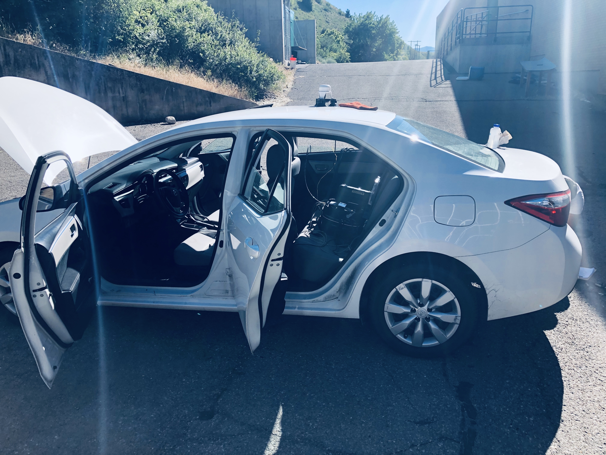
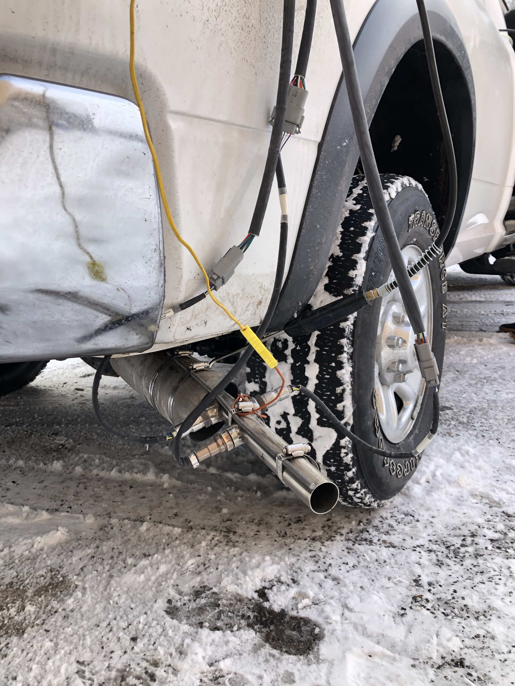
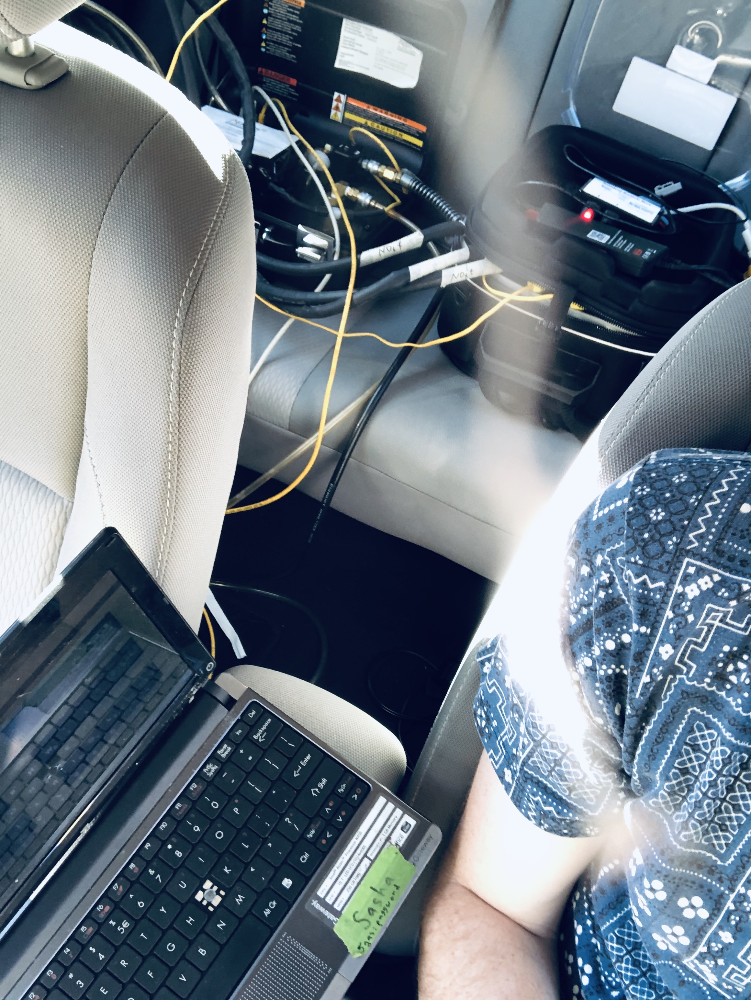

# **nh3**

nh3 is a lightweight framework for characterizing ammonia emissions under real-time driving conditions. The repo contains additional code features and performance improvements from previous implementations during this project.

 

<h4>
  <a href="https://github.com/sdbuit/nh3/blob/origin/docs/vehicle-dynamics.md" rel="./docs/">Vehicle Dynamics</a>
   · 
  <a href="https://github.com/sdbuit/nh3/blob/origin/docs/nh3-output.md">NH3 Output</a>
   · 
  <a href="https://github.com/sdbuit/nh3/blob/origin/notebooks/">Notebooks</a>
   · 
  <a href="https://github.com/sdbuit/nh3/blob/origin/docs/">Equipment</a>
</h4>

<table>
  <tr>
    <td></td>
    <td></td>
    <td></td>
  </tr>
</table>

## Overview

Sponsored by the Utah Division of Air Quality (UDAQ), involved collaboration between Utah State University (USU) and Weber State University (WSU) to measure and analyze ammonia (NH3) emissions from diesel and gasoline vehicles.

### Objectives

* Model of Utah's diesel and gasoline passenger vehicle categories. A test fleet of gasoline and diesel vehicles representative of northern Utah's population.
* Develop NH3 calibration procedure **[Picarro G2103](/docs/datasheet/Picarro_G2103_Analyzer_Datasheet_200806.pdf)** cavity ring-down spectrometer (CRDS).
* Off-road laboratory (dynamometer) measurements of diesel and gasoline vehicle NH3 emissions.
* Quantifying real driving emissions of NH3 from diesel and gasoline vehicles with respect to power levels (vehicle-specific power).

## References

- [ ] _TODO_
